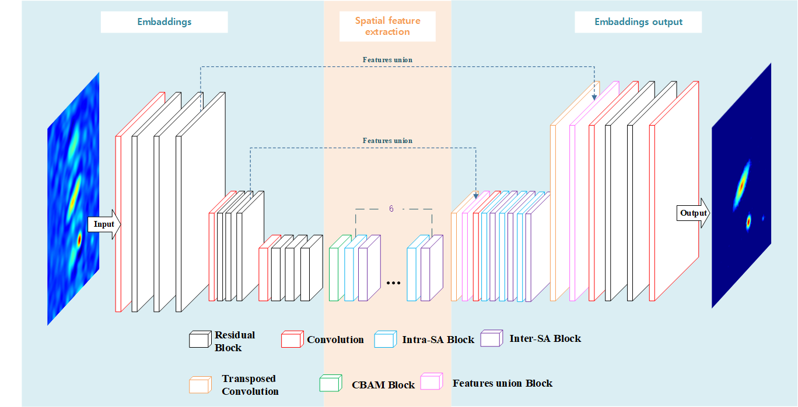

# TC-Stripformer
Pytorch Implementation of "[tc-stripformer]" 



## Installation
The implementation is modified from "[DeblurGANv2](https://github.com/VITA-Group/DeblurGANv2)"
```

cd Stripformer
conda create -n Stripformer python=3.6
source activate Stripformer
conda install pytorch==1.8.0 torchvision==0.9.0 torchaudio==0.8.0 cudatoolkit=11.1 -c pytorch -c conda-forge
pip install opencv-python tqdm pyyaml joblib glog scikit-image tensorboardX albumentations
pip install -U albumentations[imgaug]
pip install albumentations==1.1.0
```


## Training

**We train our Stripformer in two stages:** </br>
* We pre-train Stripformer for 1200 epochs with patch size 256x256 </br> 
* Run the following command 
```
python train_Stripformer_pretrained.py

```

## Testing
```
python predict_GoPro_test_results.py --weights_path ./Stripformer_gopro.pth 
```

```
python predict_RealBlur_J_test_results.py --weights_path ./Stripformer_realblur_J.pth 
```
```
python predict_RealBlur_R_test_results.py --weights_path ./Stripformer_realblur_R.pth 
```

**For testing your own training weight (take GoPro for a example)** </br>
* Rename the path in line 23 in the predict_GoPro_test_results.py </br>
* Chage command to --weights_path ./final_Stripformer_gopro.pth

